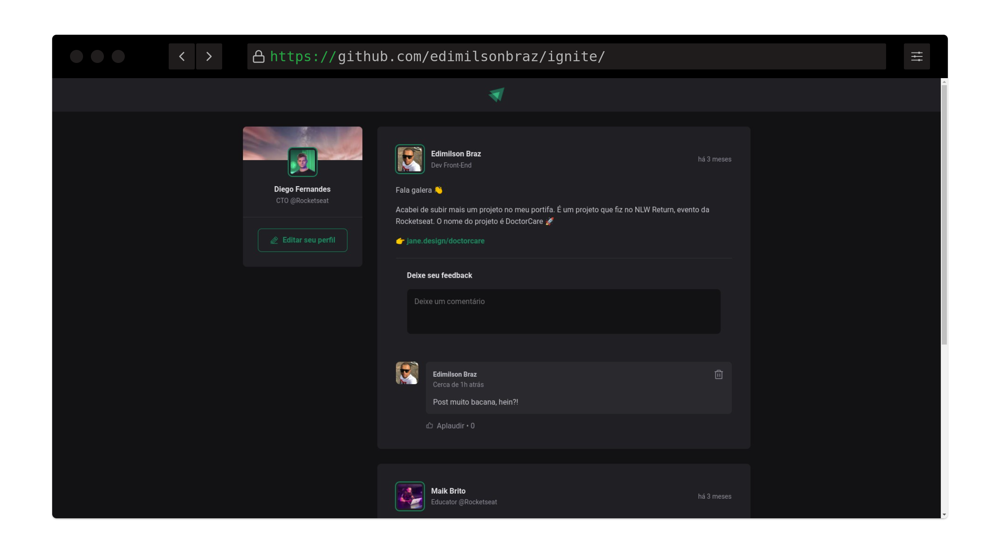

# Aula 01 - BLOG POST
<h1 align="center">
  
</h1>
 

## Sobre a aplicação:
É uma aplicação que simula o comportamento de uma rede social com vários posts, comentários com opção de dar like nos posts.

Nesse módulo, criaremos uma aplicação React utilizando o Vite e aprenderemos sobre os conceitos mais importantes do React, entre eles estão componentização, propriedades, estados, imutabilidade e hooks, além de aplicar o TypeScript no nosso projeto para adicionar tipagem estática à aplicação.