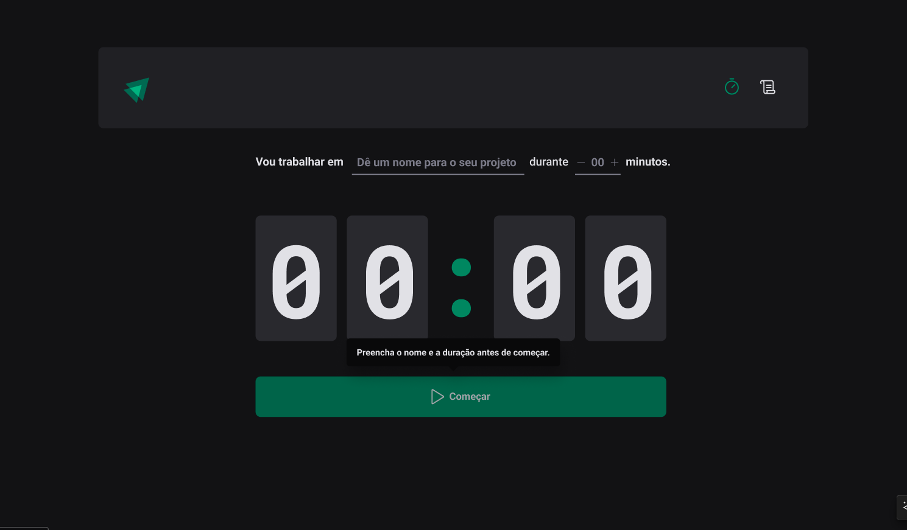

# Aula 02 - IGNITE TIMER
<h1 align="center">
  
</h1>
 

## Sobre a aplicação:
É uma aplicação de Pomodoro que te ajudar a trabalhar muito mais focado por determinaodo tempo,
com pequenos intervalos de descanso.

Nesse módulo iremos construir uma aplicação completa com roteamento e diversos conceitos 
importantes do ecossistema React como ContextAPI, useReducer, immer e muito mais.