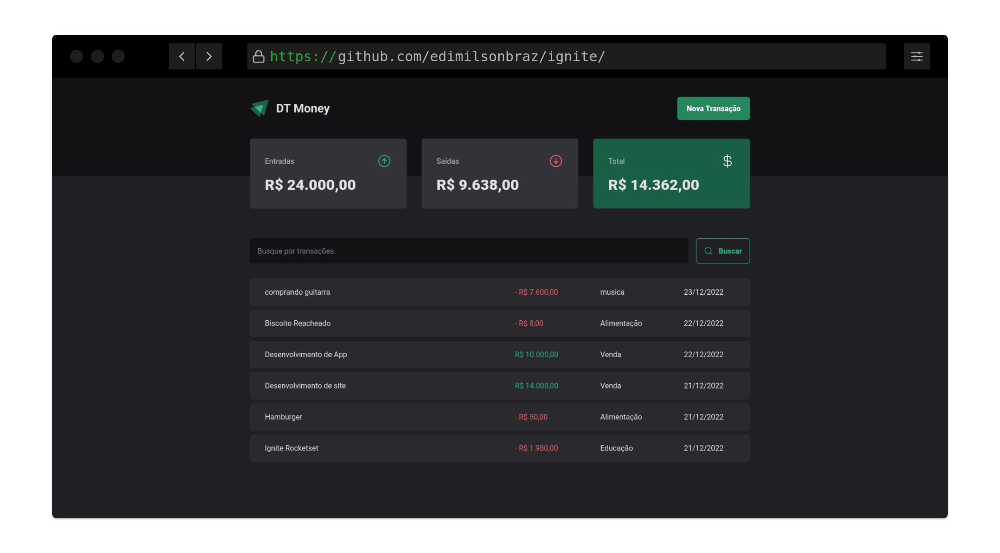

# Aula 03 - DT-MONEY
<h1 align="center">
  
</h1>
 

## Sobre a aplicação:
É uma aplicação de controle financeiro que tem entradas, saídas e um calculo de total das transações.

Nesse módulo construiremos uma aplicação front-end web completa, conectando a uma API e veremos como performar aplicações com o React entendendo como funcionam os algoritmos internos da biblioteca e todo fluxo de renderização de componentes.

