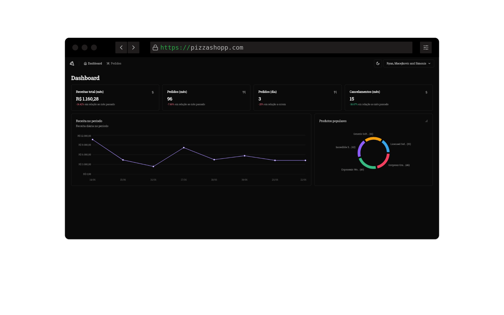

# Aula 06 - Pizza Shop
<h1 align="center">
  
</h1>
 

## Sobre a aplicação:
É uma aplicação de controle financeiro que tem entradas, saídas e um calculo de total das transações.

Nesse módulo construiremos uma aplicação que vai funcionar como um dashboard para lojistas que possuem um restaurante dentro de um aplicativo de delivery. A ideia é que nesse dashboard o lojista possa acompanhar as métricas do restaurante, como pedidos mensais, diários, utilizar gráficos e também acompanhar individualmente cada pedido, obter detalhes, quais itens foram vendidos e alterar status desses pedidos.

