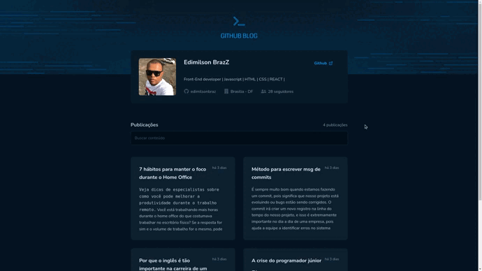

# Desafio 03 - Github Blog
<h1 align="center">
  
</h1>
 

## :point_right: Sobre o desafio:
Nesse desafio, foi desenvolvido uma aplicação que utiliza a API do GitHub para buscar issues de um repositório, dados do perfil do usuário e exibe elas como em um blog.

## :point_right: Desafio proposto
- Listagem do seu perfil com imagem, número de seguidores, nome e outras informações disponíveis pela API do GitHub.
- Listar e filtrar todas as issues do repositório com um pequeno resumo do conteúdo dela
- Criar uma página para exibir um post (issue) completo

## :point_right: Bibliotecas utilizado nesse projeto:
- ⚛️ Axios -> chamada http
- ⚛️ React Router DOM -> roteamento
- ⚛️ React Hook Form -> manipulando formulário
- ⚛️ Zod -> definindo regras para validar dados
- ⚛️ react-markdown -> Converter textos em markdown para HTML
