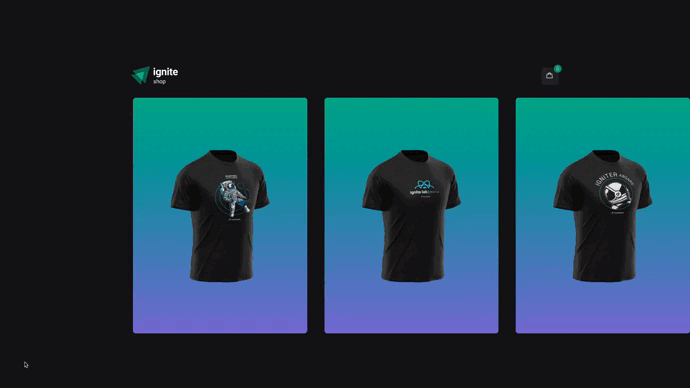

# Desafio 04 - Ignite Shop
<h1 align="center">
  
</h1>
 

## :point_right: Sobre o desafio:
Nesse desafio, foi implementado uma nova feature na aplicação que já desenvolvemos na trilha. A feature se resume em um carrinho de compras que utilizará os dados da API do Stripe para buscar os itens existentes, e controlará, através da sua aplicação, o número de itens que a pessoa deseja comprar.

## :point_right: Desafio proposto
- Utilizar a listagem já criada pela aplicação e adicionar a possibilidade de adicionar itens ao carrinho na página do produto.
- Salvar todos os itens selecionados em sua aplicação, e exibir o número de itens no carrinho
- Enviar o carrinho que você armazenou na aplicação para a rota de checkout, onde irá gerar a sessão de checkout com os `line_items` necessários.

## :point_right: Bibliotecas utilizado nesse projeto:
- ⚛️ NextJs
- ⚛️ Stitches 
- ⚛️ Context API
- ⚛️ Stripe -> API
- ⚛️ Axios
